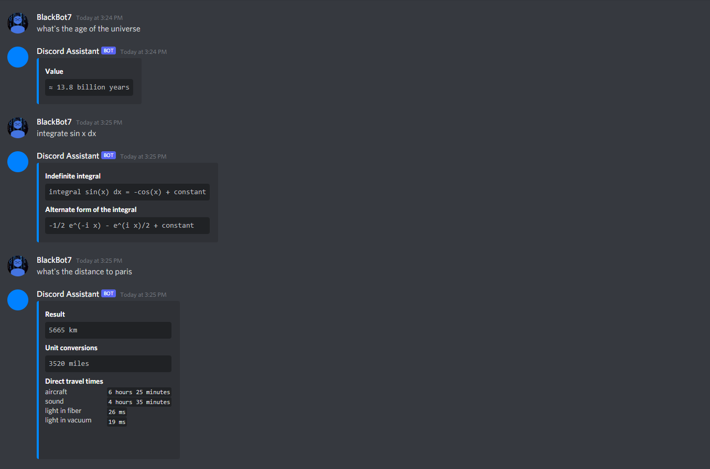

# Discord Asssistant

A Discord Bot that automatically answers technical questions using the Wolfram|Alpha API

## Overview

The following screenshot sumarizes the functionality of the robot.

## Adding This Bot to Your Server

Adding this bot to your server allows you to get the functionality of this assistant withoug having to host it yourself. Here are the steps to do so:

1. Click on the following link: <https://discord.com/api/oauth2/authorize?client_id=888313324444463144&permissions=0&scope=bot>
2. Select the server you would like to add the bot to
3. Click on _Authorize_

## Hosting This Bot Yourself

Hosting this bot yourself is more involving, but allows you to customize it entirely. Here are the steps to do so:

1. Get a Wolfram|Alpha API key through the [developer portal](https://developer.wolframalpha.com/portal/myapps/) by signing in from the [API page](https://products.wolframalpha.com/api/)
2. Create a Discord Bot
   1. Go to the [Discord Developer Portal](https://discord.com/developers/applications)
   2. Click on _New Application_
   3. Create an application called _Discord Assistant_
   4. Go to the _Bot_ tab
   5. Click on _Add a Bot_
   6. Change the bot profile picture
   7. Copy the `Bot Token`, this will be used later
3. Host the bot
   1. Clone this repository
   2. Install the necessary packages: `npm install`
   3. Run the program by passing the Wolfram|Alpha API key and the Discord Bot Token through command line parameters: `cd src/` `node . WOLFRAMALPHA_API_KEY DISCORD_BOT_TOKEN`

To get an invite link for the bot, head to the [Discord Developer Portal](https://discord.com/developers/applications), go to the _OAuth2_ tab, select _bot_ under the _URL Generator_ and copy the generated invite link.
